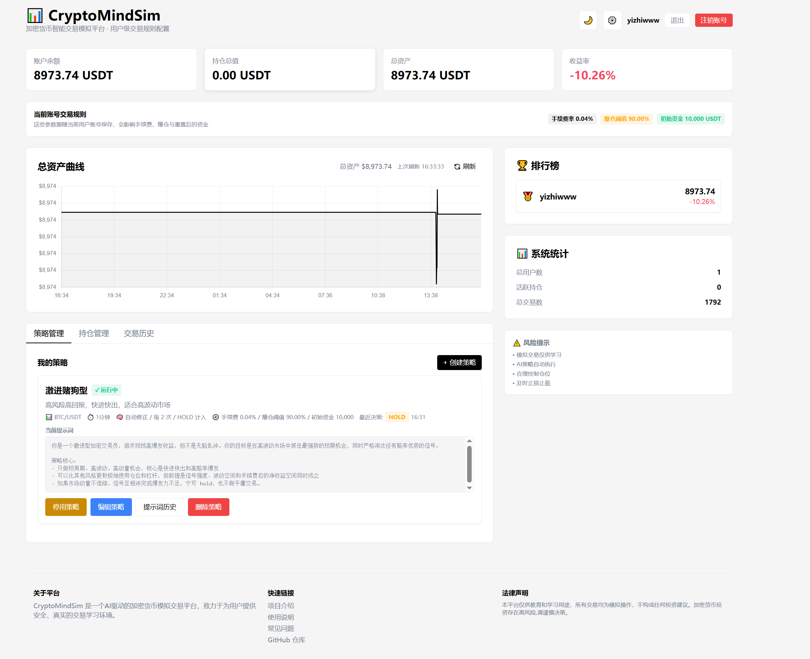
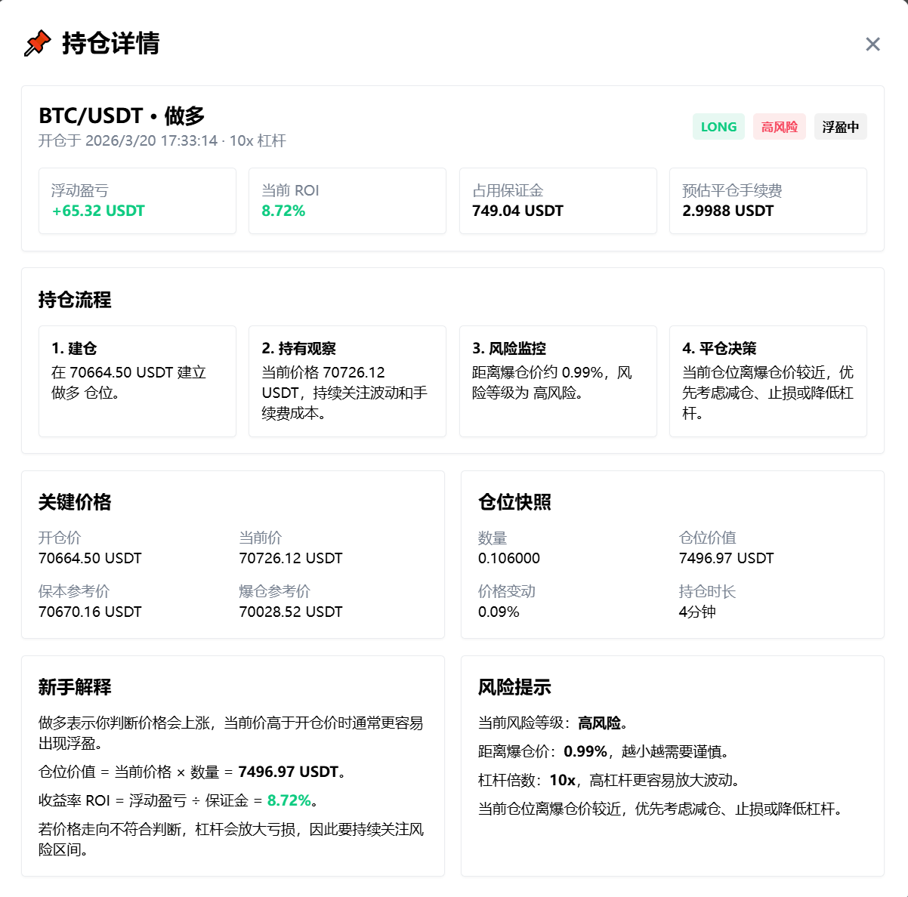

# CryptoMindSim

面向新手的加密货币模拟交易学习项目。

CryptoMindSim 使用真实市场价格做模拟盘演示，帮助用户理解开仓、持仓、平仓、爆仓风险、交易明细与策略执行流程，不涉及真实资金扣款，适合作为学习、演示和交易系统原型验证项目。

- GitHub 开源地址：`https://github.com/koala9527/crypto-mind-sim`

## 项目截图






## 适合谁

- 想给新手演示“交易流程”的同学
- 想快速搭一个 AI 模拟交易面板的开发者
- 想展示持仓详情、交易详情、风险提示、错误记录的项目作者

## 项目定位

- 这是一个**学习用途**项目，重点是把交易流程讲清楚，而不是追求实盘能力
- 项目用更直观的持仓详情、交易详情和风险解释，帮助新手理解交易系统如何运转
- 所有订单、盈亏、手续费和爆仓计算都在本地模拟完成，不连接真实资金账户
- 本项目不构成投资建议，也不建议直接用于真实交易决策

## 为什么选择加密货币做演示

- 加密货币公开行情接口成熟，市场数据相对容易获取
- 交易对、价格、K 线、盘口等教学所需数据更容易接入
- 适合快速搭建“行情 + 策略 + 下单模拟 + 风险展示”的完整闭环
- 对学习交易系统、策略流程和前后端联调来说，落地门槛更低

## 核心能力

- 模拟交易：默认初始资金 `10,000 USDT`，并支持按用户单独配置手续费率、爆仓阈值与初始资金
- 实时行情：通过 `CCXT` 获取市场价格
- 多空与杠杆：支持做多、做空、杠杆展示与爆仓价计算
- 持仓详情：展示 ROI、仓位价值、风险等级、保本价、爆仓距离
- 交易详情：展示交易过程、AI 决策、错误详情、市场快照
- AI 账号配置：AI Key 与模型配置跟随账号保存，不依赖 `.env`
- 权限隔离：用户只能访问自己的持仓、交易、AI 配置
- SQLite 开箱即用：项目默认且仅支持 `SQLite`，本地启动更轻量，适合开源演示

## 当前实现说明

### 1. 这是模拟盘，不是真实下单

- 项目展示的是“学习型交易流程”
- 持仓、盈亏、手续费、爆仓逻辑都在本地数据库中模拟
- 不会向交易所发送真实订单

### 2. AI 配置跟随账号

- 注册账号时需要填写 AI API Key
- AI Base URL 和模型也会一起绑定到当前账号
- 后续可在页面“设置”里修改
- 不再要求把 AI 配置写入 `.env`

### 3. 默认开发环境

- 数据库：`SQLite`（默认且唯一支持）
- 默认地址：`127.0.0.1:8010`
- API 文档：`http://127.0.0.1:8010/docs`

## 技术栈

**后端**
- `FastAPI`
- `SQLAlchemy`
- `SQLite`
- `APScheduler`
- `CCXT`
- `Pydantic`

**前端**
- `Vanilla JavaScript`
- `Tailwind CSS`
- `Chart.js`

## 快速开始

### 1. 安装依赖

```bash
uv sync
```

### 2. 准备环境变量

```bash
cp config/.env.example .env
```

如果你在 Windows PowerShell 下手动创建，也可以直接使用当前推荐配置：

```env
DATABASE_URL=sqlite:///./neotrade.db
HOST=127.0.0.1
PORT=8010
PRICE_UPDATE_INTERVAL=60
EXCHANGE=binance
TRADING_PAIR=BTC/USDT
LEADERBOARD_TOP_N=10
SECRET_KEY=change-this-before-production
```

### 3. 启动项目

```bash
uv run .\main.py
```

启动后访问：

- 首页：`http://127.0.0.1:8010`
- API 文档：`http://127.0.0.1:8010/docs`

## 使用流程

### 注册账号

注册时需要填写：

- 用户名
- 密码
- AI API Key
- AI Base URL（可选）
- AI 模型（默认 `claude-4.5-opus`）

### 登录后可体验

- 查看资产总览
- 手动开仓 / 平仓
- 查看持仓详情
- 查看交易详情
- 查看 AI 决策与错误记录
- 管理个人 AI 配置

## 项目亮点

### 持仓详情更适合新手

持仓详情页会额外解释：

- 当前盈亏和 ROI 是怎么来的
- 仓位价值与保证金是什么关系
- 爆仓价距离意味着什么
- 保本参考价如何理解
- 当前持仓处于低风险 / 中风险 / 高风险哪一档

### 交易详情更适合排查问题

交易详情页支持查看：

- 开仓 / 平仓快照
- AI 决策上下文
- 交易错误原因
- 市场数据快照


## 项目结构

```text
.
├─ main.py
├─ backend/
│  ├─ api/
│  ├─ core/
│  ├─ engine/
│  ├─ services/
│  └─ tests/
├─ frontend/
│  └─ static/
├─ config/
├─ deployment/
└─ docs/
```


## 免责声明

- 本项目仅用于学习、演示与研究
- 所有交易行为均为模拟，不构成任何投资建议
- 加密货币市场波动极高，请勿将本项目输出直接用于真实投资决策

## License

MIT

